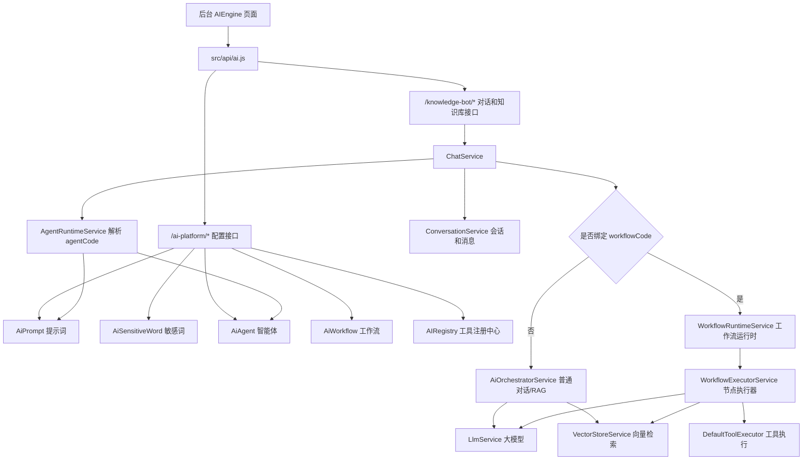
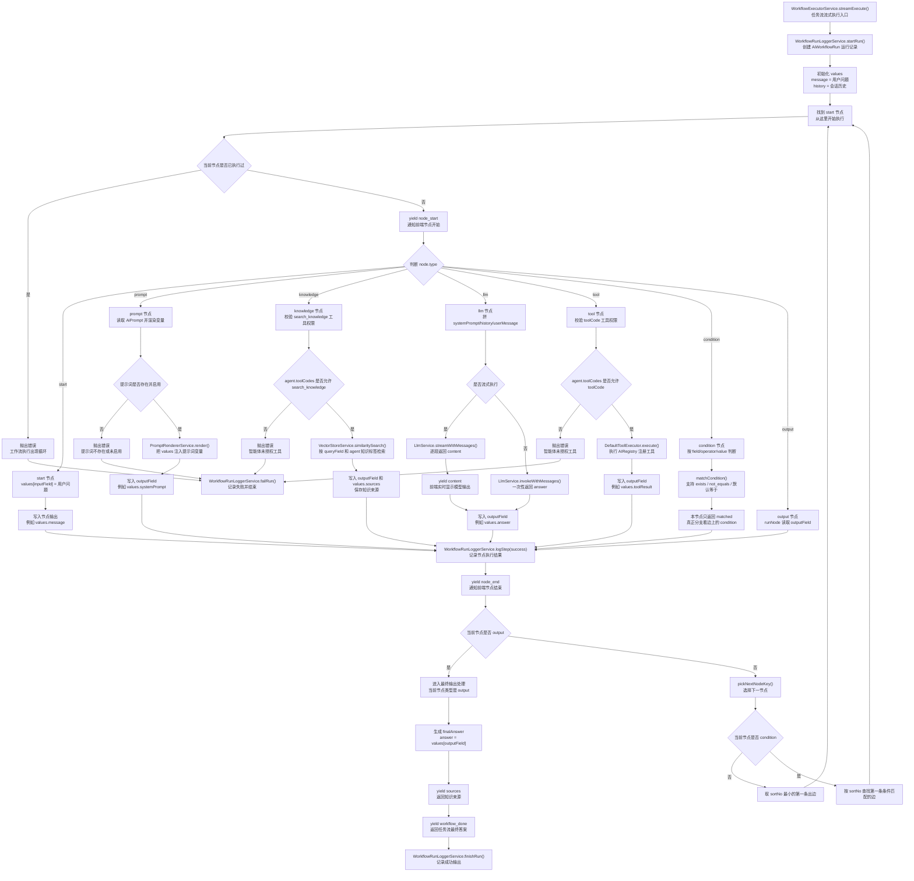
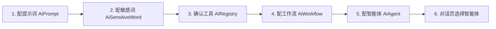
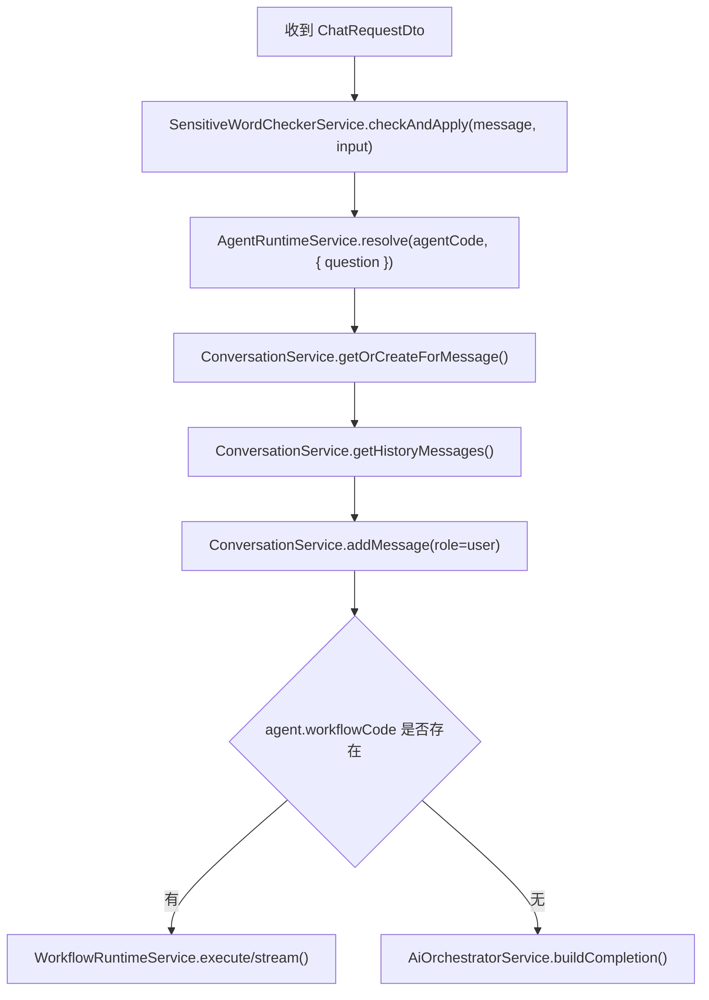
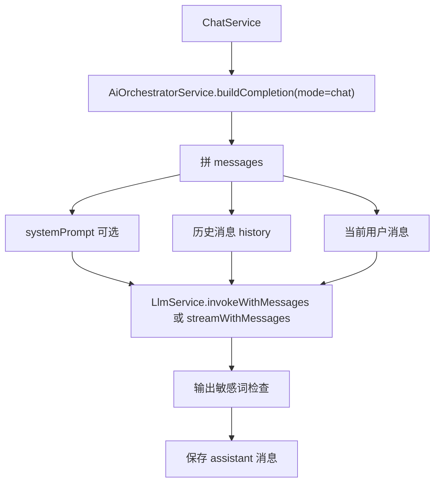
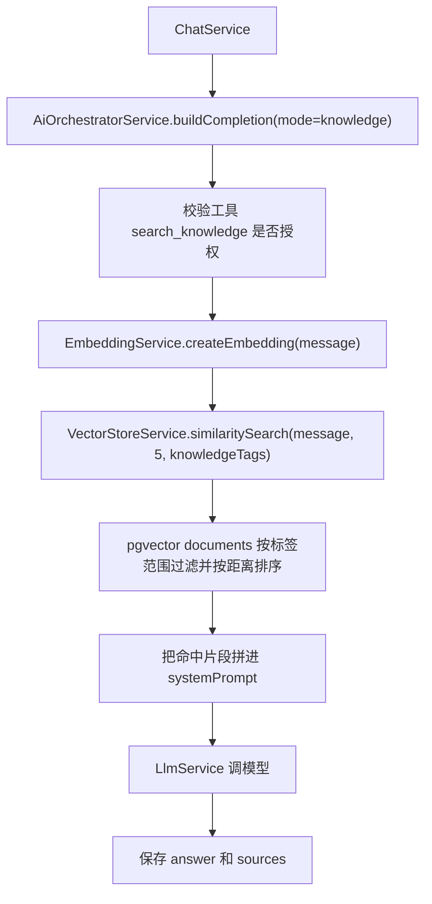
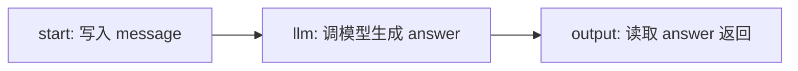
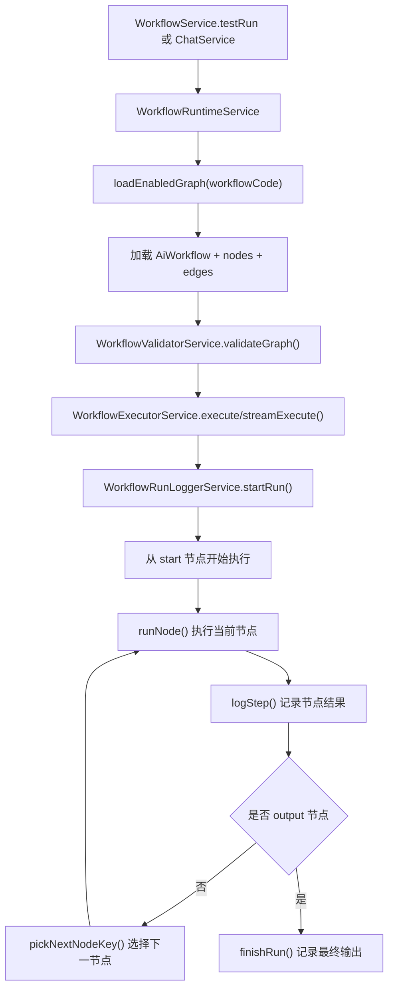

# AI 流程串联说明

本文用于解释当前项目 AI 功能的完整运行链路，重点回答两个问题：

1. 配置端配置了哪些东西，这些配置最终如何影响一次对话。
2. 对话端发送消息后，后端如何决定走普通聊天、知识库问答或工作流。
3. 工作流应该如何配置，运行时每类节点具体做什么。

本文只描述当前源码中的实际链路，不描述尚未落地的设想。

## 1. 总览

当前 AI 主线分成两层：

- `src/modules/knowledge-bot`：对外业务 API，负责对话、会话、知识库管理。
- `src/ai-engine`：运行时能力层，负责提示词渲染、敏感词、大模型、向量检索、工具执行、工作流执行。

前端管理页面在 `vue-element-admin-dev/src/views/AIEngine`，统一接口封装在 `vue-element-admin-dev/src/api/ai.js`。

整体关系如下：



一句话理解：

> 配置端通过 `AiAgent` 把提示词、模型参数、知识库开关、工具白名单、可选工作流组合成一个智能体；对话端只要发送 `agentCode`，后端就能解析出完整运行配置，然后决定走普通聊天、知识库问答或工作流。

### 1.1 AI 对话详细分支流程图

下面这张图按一次“AI 对话”请求从前端到后端的真实执行顺序展开。这里的“任务流”和“工作流”指同一件事，源码里叫 `AiWorkflow`。

```mermaid
flowchart TD
  A["AI 对话页面<br/>chat/index.vue"] --> A1{"用户选择哪种入口"}
  A1 -- "基础对话<br/>mode = chat" --> A2["handleSendMessage()<br/>组装 message + mode"]
  A1 -- "知识库问答<br/>mode = knowledge" --> A2
  A1 -- "工作流智能体<br/>选择 agentCode" --> A3["handleAgentChange()<br/>按 AiAgent 同步 mode"]
  A3 --> A2

  A2 --> A4{"是否已有会话"}
  A4 -- "有 conversationId" --> A5["请求带 conversationId<br/>追加到历史会话"]
  A4 -- "无 conversationId" --> A6["请求不带 conversationId<br/>后端自动创建会话"]
  A5 --> B["sendAiChatStream()<br/>POST /knowledge-bot/chat/stream"]
  A6 --> B
  B --> C["ChatController.stream()<br/>写入 SSE 响应头"]
  C --> D["ChatService.stream()<br/>进入对话主流程"]

  D --> E["SensitiveWordCheckerService.checkAndApply(input)<br/>检查用户输入敏感词"]
  E --> E1{"输入是否命中 block"}
  E1 -- "是" --> ERR["ChatController 捕获异常<br/>写 type=error + [DONE]"]
  E1 -- "否或 replace" --> F["AgentRuntimeService.resolve(agentCode)<br/>解析智能体配置"]

  F --> F1{"是否传 agentCode"}
  F1 -- "未传" --> F2["agent = null<br/>使用请求里的 mode"]
  F1 -- "已传" --> F3["查询 AiAgent<br/>要求 status = 1"]
  F3 --> F4{"Agent 是否存在并启用"}
  F4 -- "否" --> ERR
  F4 -- "是" --> F6["查询 AiPrompt<br/>要求提示词启用"]
  F6 --> F7{"Prompt 是否存在并启用"}
  F7 -- "否" --> ERR
  F7 -- "是" --> F9["PromptRendererService.render()<br/>渲染 systemPrompt 和变量"]

  F2 --> G["ConversationService.getOrCreateForMessage()<br/>获取或创建会话"]
  F9 --> G
  G --> H["ConversationService.getHistoryMessages()<br/>读取最近历史消息"]
  H --> I["ConversationService.addMessage(user)<br/>保存用户消息和 agent 元信息"]
  I --> J{"agent.workflowCode 是否存在"}

  J -- "存在<br/>进入任务流" --> W["WorkflowRuntimeService.stream()<br/>加载并流式执行工作流"]
  J -- "不存在<br/>继续普通编排" --> K{"最终 mode 是什么"}

  K -- "chat<br/>基础对话" --> L1["AiOrchestratorService.buildCompletion(chat)<br/>拼 systemPrompt + history + message"]
  K -- "knowledge<br/>知识库问答" --> R1["AiOrchestratorService.buildCompletion(knowledge)<br/>准备 RAG 问答"]

  L1 --> L2["LlmService.streamWithMessages()<br/>调用大模型流式生成"]
  L2 --> L3["yield content<br/>前端逐段追加 AI 回复"]
  L3 --> Z1["SensitiveWordCheckerService.checkAndApply(output)<br/>完整输出敏感词检查"]
  Z1 --> Z2["ConversationService.addMessage(assistant)<br/>保存 AI 回复"]
  Z2 --> Z3["yield sources<br/>基础对话 sources 为空"]
  Z3 --> Z4["ChatController 写 data: [DONE]<br/>本轮结束"]

  R1 --> R2{"是否需要校验 search_knowledge"}
  R2 -- "选择了 agent<br/>有工具白名单" --> R3{"toolCodes 是否包含 search_knowledge"}
  R2 -- "未选择 agent<br/>无白名单" --> R5["VectorStoreService.similaritySearch()<br/>无标签范围则全局检索"]
  R3 -- "否" --> ERR
  R3 -- "是" --> R5
  R5 --> R6["EmbeddingService.createEmbedding()<br/>把问题转成向量"]
  R6 --> R7["pgvector documents 距离查询<br/>按语义距离取前 5 条"]
  R7 --> R8["拼知识库 systemPrompt<br/>把命中片段交给模型"]
  R8 --> R9["LlmService.streamWithMessages()<br/>流式生成知识库答案"]
  R9 --> R10["yield content<br/>前端逐段追加 AI 回复"]
  R10 --> R11["SensitiveWordCheckerService.checkAndApply(output)<br/>完整输出敏感词检查"]
  R11 --> R12["ConversationService.addMessage(assistant)<br/>保存答案和 sources"]
  R12 --> R13["yield sources<br/>前端展示引用来源"]
  R13 --> Z4

  W --> W1["loadEnabledGraph(workflowCode)<br/>查询启用工作流和节点连线"]
  W1 --> W2["WorkflowValidatorService.validateGraph()<br/>校验 start/output/连线/循环"]
  W2 --> W3["WorkflowExecutorService.streamExecute()<br/>开始任务流执行"]
  W3 --> W4["yield workflow_start<br/>前端显示任务流开始"]
  W4 --> W5["逐个执行节点<br/>start/prompt/knowledge/llm/tool/condition/output"]
  W5 --> W6["yield node_start / node_end<br/>前端显示节点状态"]
  W6 --> W7{"执行到 llm 节点"}
  W7 -- "是" --> W8["yield content<br/>大模型内容实时返回"]
  W7 -- "否" --> W9["继续下一个节点<br/>按连线和条件选择"]
  W8 --> W9
  W9 --> W10{"执行到 output 节点"}
  W10 -- "否" --> W5
  W10 -- "是" --> W11["yield sources + workflow_done<br/>返回任务流最终结果"]
  W11 --> W12["SensitiveWordCheckerService.checkAndApply(output)<br/>完整输出敏感词检查"]
  W12 --> W13["ConversationService.addMessage(assistant)<br/>保存答案和 workflowCode"]
  W13 --> Z4
  ERR --> Z4
```



这张图里有三条最重要的主路径：

| 路径 | 触发条件 | 核心服务 | 结果 |
| --- | --- | --- | --- |
| 基础对话 | `workflowCode` 为空，最终 `mode = chat` | `AiOrchestratorService` + `LlmService` | 直接把提示词、历史消息、用户问题交给模型 |
| 知识库问答 | `workflowCode` 为空，最终 `mode = knowledge` | `VectorStoreService` + `AiOrchestratorService` + `LlmService` | 先检索知识库，再把知识片段拼进 system prompt |
| 任务流 | 选择的 `AiAgent.workflowCode` 有值 | `WorkflowRuntimeService` + `WorkflowExecutorService` | 按工作流节点顺序执行，可包含提示词、知识库、模型、工具、条件 |

### 1.2 任务流节点执行详细流程图

任务流不是一个单独的大模型调用，而是一个“节点图执行器”。它每一步都围绕 `values` 变量池读写数据。



任务流配置时可以按这条线理解：

1. `start` 决定用户输入放到变量池哪个字段。
2. `prompt` 决定系统提示词怎么生成。
3. `knowledge` 决定是否从知识库取资料。
4. `llm` 决定把哪些字段交给模型。
5. `tool` 决定是否调用外部或业务工具。
6. `condition` 决定下一步走哪条连线。
7. `output` 决定最终把哪个字段作为 AI 回复。

### 1.3 三种入口的最小配置要求

| 入口 | 前端怎么选 | Agent 要不要配 | 必要配置 | 常见失败点 |
| --- | --- | --- | --- | --- |
| 基础对话 | 选择“普通聊天”，也可以不选智能体 | 可选 | 模型环境变量或 agent 的 `model` | 模型密钥、模型名、网络不可用 |
| 带提示词的基础对话 | 选择一个无 `workflowCode`、`mode = chat` 的 agent | 必须 | 启用的 `AiAgent` + 启用的 `AiPrompt` | agent 未启用、prompt 未启用、提示词变量缺失 |
| 知识库问答 | 选择“知识库问答”，或选择 `knowledgeEnabled = true` 的 agent | 可选 | `documents` 中有向量数据，Embedding 可用 | 无知识数据、向量维度不匹配、检索为空 |
| 带 agent 的知识库问答 | 选择 `mode = knowledge` 或 `knowledgeEnabled = true` 的 agent | 必须 | agent 的 `toolCodes` 包含 `search_knowledge`；如配置 `knowledgeTags`，文档 `metadata.tags` 需要命中 | 报“智能体未授权工具：search_knowledge”或检索范围内无结果 |
| 任务流/工作流 | 选择绑定了 `workflowCode` 的智能体 | 必须 | 启用的 agent、启用的 workflow、合法节点和连线 | 工作流未启用、图校验失败、工具未授权 |
| 流式任务流 | 聊天页选择工作流智能体后发送 | 必须 | 工作流最多一个 `llm` 节点 | 多个 LLM 节点会报“当前版本仅支持一个流式 LLM 节点” |

## 2. 核心数据模型

这些模型定义在 `nestjs-prisma/prisma/schema.prisma`。

| 模型 | 作用 | 关键字段 |
| --- | --- | --- |
| `Document` | 知识库切片和向量 | `content`、`metadata`、`embedding` |
| `AiConversation` | 用户会话 | `userId`、`title`、`mode`、`agentCode`、`isDeleted` |
| `AiMessage` | 会话消息 | `role`、`content`、`sources`、`agentCode`、`promptId`、`workflowCode` |
| `AiPrompt` | 提示词配置 | `code`、`name`、`scene`、`content`、`variables`、`status` |
| `AiSensitiveWord` | 输入/输出敏感词 | `word`、`action`、`replaceWith`、`scope`、`status` |
| `AiAgent` | 智能体运行配置 | `code`、`promptId`、`mode`、`model`、`knowledgeEnabled`、`knowledgeTags`、`toolCodes`、`workflowCode` |
| `AiWorkflow` | 工作流基础信息 | `code`、`name`、`status`、`version` |
| `AiWorkflowNode` | 工作流节点 | `workflowId`、`nodeKey`、`type`、`name`、`config`、`sortNo` |
| `AiWorkflowEdge` | 工作流连线 | `workflowId`、`fromNodeKey`、`toNodeKey`、`condition`、`sortNo` |
| `AiWorkflowRun` | 工作流运行记录 | `conversationId`、`agentCode`、`workflowCode`、`status`、`input`、`output` |
| `AiWorkflowRunStep` | 工作流节点运行记录 | `runId`、`nodeKey`、`nodeType`、`status`、`output`、`errorMessage` |

其中 `AiAgent` 是最重要的中心对象。后续排查 AI 行为时，优先看本次请求有没有 `agentCode`，再看这个 agent 绑定了什么 prompt、tool、workflow。

## 3. 配置流程

配置端主要是 `/ai-platform/*` 接口。前端统一在 `vue-element-admin-dev/src/api/ai.js` 中封装。

### 3.1 推荐配置顺序

推荐按下面顺序配置：



如果只是普通聊天，工作流可以不配。

如果要知识库问答，需要先保证知识库里有 `Document` 数据，并且选中的 agent 允许 `search_knowledge` 工具。

如果要工作流执行，需要先配置并启用工作流，再在 agent 上绑定 `workflowCode`。

### 3.2 提示词配置

前端页面：

- `vue-element-admin-dev/src/views/AIEngine/prompt/index.vue`

后端接口：

- `GET /ai-platform/prompt/list`
- `GET /ai-platform/prompt/detail`
- `POST /ai-platform/prompt`
- `POST /ai-platform/prompt/update`
- `POST /ai-platform/prompt/status`

后端服务：

- `src/modules/ai-platform/prompt/prompt.service.ts`

运行时使用：

- `AgentRuntimeService.resolve()` 根据 `AiAgent.promptId` 找启用的 `AiPrompt`。
- `PromptRendererService.render()` 用请求上下文变量替换提示词里的 `{变量名}`。

当前对话链路里传给提示词的变量主要是：

| 变量名 | 来源 | 说明 |
| --- | --- | --- |
| `question` | 用户当前消息 | `ChatService` 调用 `AgentRuntimeService.resolve(agentCode, { question })` 时传入 |

如果提示词配置了必填变量，但运行时没有传入对应值，会抛出 `缺少提示词变量：xxx`。

### 3.3 敏感词配置

前端页面：

- `vue-element-admin-dev/src/views/AIEngine/sensitiveWord/index.vue`

后端接口：

- `GET /ai-platform/sensitive-word/list`
- `GET /ai-platform/sensitive-word/detail`
- `POST /ai-platform/sensitive-word`
- `POST /ai-platform/sensitive-word/update`
- `POST /ai-platform/sensitive-word/status`

后端服务：

- `src/modules/ai-platform/sensitive-word/sensitive-word.service.ts`
- `src/ai-engine/safety/sensitive-word-checker.service.ts`

字段含义：

| 字段 | 说明 |
| --- | --- |
| `word` | 命中的词 |
| `scope` | 生效范围，`input`、`output`、`both` |
| `action` | 处理动作，目前有 `block`、`replace` |
| `replaceWith` | `replace` 时替换成的内容 |
| `status` | 1 启用，0 停用 |

对话运行时会做两次检查：

1. 输入检查：用户消息进入会话前检查。
2. 输出检查：大模型或工作流生成完整答案后检查。

需要注意：当前流式接口是边生成边推给前端，输出敏感词是在完整答案生成后再检查，所以已经推给前端的片段无法撤回。生产级安全需要改成先缓冲再发，或做分段安全处理。

### 3.4 工具配置

工具列表接口：

- `GET /ai-platform/tool/list`

后端服务：

- `src/modules/ai-platform/tool/tool.service.ts`
- `src/ai-engine/core/ai.registry.ts`
- `src/ai-engine/tools/tool.executor.ts`

工具不是直接从数据库表里执行，而是来自运行时 `AIRegistry` 注册中心。也就是说：

- agent 里的 `toolCodes` 只是白名单配置。
- 真正可执行的工具必须已经注册到 `AIRegistry`。
- `AgentService` 保存 agent 时会校验 `toolCodes` 是否存在于 `AIRegistry.getToolNames()`。

工作流和工具白名单是两层配置：

- `workflowCode` 只决定使用哪张节点图。
- 工作流里的 `knowledge` 节点固定需要 `search_knowledge` 授权。
- 工作流里的 `tool` 节点需要授权对应 `toolCode`。
- 聊天链路执行工作流时，授权来源就是当前 agent 的 `toolCodes`。

`GET /ai-platform/agent/config-options` 会返回每个启用工作流的 `requiredToolCodes` 和 `promptIds`。后台选择工作流后会自动合并必需工具，并禁用这些必需工具选项；用户只能收窄额外工具，不能去掉工作流必需工具。

后端新增/编辑智能体时也会校验工作流必需工具。如果 `toolCodes` 缺少工作流里 `knowledge` 或 `tool` 节点依赖的工具，会直接保存失败，错误提示会列出缺失工具。

当前工具执行器只执行已经注册到 `AIRegistry` 的真实业务工具：

| 工具 | 说明 |
| --- | --- |
| `search_knowledge` | 调用向量知识库检索 |
| `get_user_menu_permissions` | 查询当前用户菜单权限 |

`knowledge-bot` 模块会注册业务相关工具。排查工具是否能用时，看两个位置：

1. `/ai-platform/tool/list` 是否能看到这个工具。
2. 当前 agent 的 `toolCodes` 是否包含这个工具。

### 3.5 智能体配置

前端页面：

- `vue-element-admin-dev/src/views/AIEngine/agent/index.vue`

后端接口：

- `GET /ai-platform/agent/list`
- `GET /ai-platform/agent/detail`
- `GET /ai-platform/agent/enabled-options`
- `GET /ai-platform/agent/config-options`
- `POST /ai-platform/agent`
- `POST /ai-platform/agent/update`
- `POST /ai-platform/agent/status`

后端服务：

- `src/modules/ai-platform/agent/agent.service.ts`
- `src/ai-engine/agent/agent-runtime.service.ts`

`AiAgent` 字段含义：

| 字段 | 说明 | 影响 |
| --- | --- | --- |
| `code` | 智能体编码 | 前端发送对话时的 `agentCode` |
| `name` | 智能体名称 | 前端下拉选择展示 |
| `promptId` | 绑定提示词 ID | 决定 system prompt |
| `mode` | 默认模式 | `chat` 普通聊天，`knowledge` 知识库问答 |
| `model` | 模型名称 | 传给 `LlmService`，为空则走环境变量默认模型 |
| `temperature` | 生成随机性 | 传给大模型 |
| `topP` | 采样范围 | 传给大模型 |
| `knowledgeEnabled` | 是否强制知识库模式 | 为 true 时，运行时 mode 固定为 `knowledge` |
| `knowledgeTags` | 知识库检索标签范围 | 为空时全局检索；有值时只检索 `Document.metadata.tags` 命中的知识 |
| `toolCodes` | 工具白名单 | 控制知识库检索和工具节点是否允许执行；绑定工作流时必须包含工作流必需工具 |
| `workflowCode` | 绑定工作流 | 有值时，对话会转到工作流执行 |
| `status` | 启停状态 | 只有启用状态可被聊天解析 |

`GET /ai-platform/agent/config-options` 会返回可选的提示词、工作流、工作流依赖和工具，用于 agent 表单配置。

`GET /ai-platform/agent/enabled-options` 会返回聊天页可选择的启用智能体。

后台智能体页面的“知识范围”会维护 `knowledgeTags`。这个字段不会创建新的知识库集合表，而是复用知识文档的 `metadata.tags`：创建或上传知识时给文档打标签，智能体配置相同标签后，普通 RAG 和工作流 `knowledge` 节点都会按这些标签过滤。未配置 `knowledgeTags` 的旧智能体保持全局检索行为。

## 4. 对话流程

### 4.1 前端发送流程

聊天页面：

- `vue-element-admin-dev/src/views/AIEngine/chat/index.vue`

接口封装：

- `sendAiChat(data)` -> `POST /knowledge-bot/chat`
- `sendAiChatStream(data)` -> `POST /knowledge-bot/chat/stream`
- `getAiConversationList(params)` -> `GET /knowledge-bot/conversation/list`
- `createAiConversation(data)` -> `POST /knowledge-bot/conversation/create`
- `getAiConversationDetail(params)` -> `GET /knowledge-bot/conversation/detail`

页面初始化时：

1. 调用 `getAgentEnabledOptions()` 获取可选智能体。
2. 调用 `getAiConversationList()` 获取会话列表。

切换智能体时：

1. 更新 `selectedAgentCode`。
2. 如果 agent 指定了 `knowledgeEnabled` 或 `mode`，同步当前模式。
3. 清空当前会话和消息。
4. 按 `agentCode` 重新查会话列表。

发送消息时，请求体结构是：

```json
{
  "agentCode": "DEBUG_AGENT_WORKFLOW_TOOL_TIME",
  "message": "现在几点",
  "mode": "chat",
  "conversationId": "可选，已有会话才传"
}
```

前端默认走流式接口。收到 SSE 后按事件类型处理：

| SSE 事件 | 前端行为 |
| --- | --- |
| `content` | 追加到当前 AI 消息正文 |
| `sources` | 保存到当前 AI 消息的来源列表 |
| `error` | 把当前 AI 占位消息改成后端返回的错误提示，并停止读取 |
| `workflow_start` | 记录工作流状态标签 |
| `node_start` | 记录节点开始状态标签 |
| `node_end` | 记录节点结束状态标签 |
| `workflow_done` | 记录工作流完成状态标签 |
| `[DONE]` | 本轮流式响应结束 |

### 4.2 后端对话入口

Controller：

- `src/modules/knowledge-bot/chat/chat.controller.ts`

接口：

- `POST /knowledge-bot/chat`
- `POST /knowledge-bot/chat/stream`

两者都需要权限：

- `ai:chat:send`

非流式接口返回完整 JSON。

流式接口直接写 `text/event-stream`，不会走普通 JSON 响应封装。

### 4.3 ChatService 主流程

核心服务：

- `src/modules/knowledge-bot/chat/chat.service.ts`

非流式 `chat()` 和流式 `stream()` 的前半段基本一致：



这里有几个关键点：

1. 输入敏感词检查发生在创建会话和保存用户消息之前。
2. 历史消息在保存当前用户消息之前读取，避免当前问题在 prompt 中重复出现。
3. 用户消息和助手消息都会保存 `agentCode`、`promptId`、`workflowCode` 这些审计字段。
4. 只要解析出的 agent 有 `workflowCode`，就会走工作流分支。
5. 没有 `agentCode` 时，`AgentRuntimeService.resolve()` 返回 `null`，保持默认聊天行为。

### 4.4 AgentRuntimeService 如何解析智能体

服务：

- `src/ai-engine/agent/agent-runtime.service.ts`

解析逻辑：

1. 没传 `agentCode`：返回 `null`。
2. 传了 `agentCode`：查 `AiAgent`，要求 `status = 1`。
3. 根据 `AiAgent.promptId` 查启用的 `AiPrompt`。
4. 渲染 prompt 内容，把 `{question}` 等变量替换成运行时值。
5. 返回运行时配置：

```ts
{
  agentCode,
  promptId,
  mode,
  systemPrompt,
  llmOptions,
  toolCodes,
  workflowCode
}
```

`mode` 的判定规则：

```text
如果 knowledgeEnabled = true -> knowledge
否则如果 agent.mode = knowledge -> knowledge
否则 -> chat
```

所以 agent 的 `knowledgeEnabled` 优先级高于 `mode`。

### 4.5 普通聊天分支

触发条件：

- 没有绑定 `workflowCode`
- 当前 mode 为 `chat`

服务：

- `src/ai-engine/orchestrator/ai-orchestrator.service.ts`
- `src/ai-engine/llm/llm.service.ts`

流程：



最终模型请求中的 messages 形态是：

```ts
[
  { role: 'system', content: agent.systemPrompt },
  ...history,
  { role: 'user', content: message }
]
```

如果没有选择 agent，就没有 agent 的 system prompt，直接使用历史消息和当前问题。

### 4.6 知识库问答分支

触发条件：

- 没有绑定 `workflowCode`
- 当前 mode 为 `knowledge`

服务：

- `src/ai-engine/orchestrator/ai-orchestrator.service.ts`
- `src/ai-engine/vector/vector-store.service.ts`
- `src/ai-engine/embedding/embedding.service.ts`

流程：



知识库模式会追加固定系统约束：

```text
你是知识库问答助手。
优先根据给定知识片段回答；如果知识片段不足以回答，请明确说明知识库中没有足够信息。
知识片段：
...
```

如果选择了 agent，且 agent 的 `toolCodes` 不包含 `search_knowledge`，会报：

```text
智能体未授权工具：search_knowledge
```

如果没有选择 agent，只是手动选择知识库模式，当前代码不会传入工具白名单，所以不会触发该授权拦截。

如果选择了 agent，且 agent 配置了 `knowledgeTags`，检索会增加 `Document.metadata.tags` 过滤条件；只要文档标签命中任一 `knowledgeTags`，才会进入相似度排序。`knowledgeTags` 为空时不加过滤条件，继续保持全局知识库检索。

### 4.7 工作流对话分支

触发条件：

- 选择了 agent。
- `AiAgent.workflowCode` 有值。

非流式：

```text
ChatService.chat()
-> WorkflowRuntimeService.execute()
-> WorkflowExecutorService.execute()
-> 返回完整 answer
```

流式：

```text
ChatService.stream()
-> WorkflowRuntimeService.stream()
-> WorkflowExecutorService.streamExecute()
-> 边执行边 yield workflow/content/sources 事件
```

工作流分支不会再走 `AiOrchestratorService.buildCompletion()`，而是由工作流节点自己决定是否调用提示词、知识库、大模型或工具。

## 5. 工作流怎么配

### 5.1 工作流配置页面

前端页面：

- `vue-element-admin-dev/src/views/AIEngine/workflow/index.vue`

后端接口：

- `GET /ai-platform/workflow/list`
- `GET /ai-platform/workflow/detail`
- `POST /ai-platform/workflow`
- `POST /ai-platform/workflow/update`
- `POST /ai-platform/workflow/status`
- `POST /ai-platform/workflow/save-graph`
- `POST /ai-platform/workflow/validate`
- `POST /ai-platform/workflow/test-run`

配置分两步：

1. 创建工作流基础信息：编码、名称、描述、版本、状态。
2. 打开“配置”，维护节点和连线，然后保存图。

保存图时，后端会先校验，再删除该工作流原有节点和连线，最后重新写入当前提交的节点和连线。因此保存前要确认页面上的节点和连线是完整图。

### 5.2 工作流基础信息

| 字段 | 说明 |
| --- | --- |
| `code` | 工作流编码，agent 绑定时使用 |
| `name` | 工作流名称 |
| `description` | 描述 |
| `version` | 版本号 |
| `status` | 1 启用，0 停用 |
| `remark` | 备注 |

如果有启用的 agent 正在绑定某个工作流，停用这个工作流时后端会拦截：

```text
已有启用智能体绑定该工作流，不能停用
```

### 5.3 图校验规则

后端校验服务：

- `src/ai-engine/workflow/workflow-validator.service.ts`

保存和测试前都会校验：

1. `nodeKey` 不能重复。
2. 节点类型必须是支持的类型。
3. 必须且只能有一个 `start` 节点。
4. 至少需要一个 `output` 节点。
5. 所有边的起点、终点都必须存在。
6. 工作流不能包含循环。
7. 不同节点类型必须有对应必填配置。

### 5.4 节点类型和配置

当前支持 7 类节点：

| 类型 | 中文含义 | 必填配置 | 运行时行为 |
| --- | --- | --- | --- |
| `start` | 开始节点 | `inputField` | 把用户消息写入变量池指定字段 |
| `prompt` | 提示词节点 | `promptId`、`outputField` | 读取启用提示词，按变量池渲染后写入输出字段 |
| `knowledge` | 知识库检索节点 | `queryField`、`outputField` | 读取查询字段，执行向量检索，写入 sources |
| `llm` | 大模型节点 | `userMessageField`、`outputField` | 读取用户消息字段和可选系统提示字段，调用大模型 |
| `tool` | 工具节点 | `toolCode`、`outputField` | 调用工具执行器，结果写入输出字段 |
| `condition` | 条件节点 | `field`、`operator` | 根据变量池字段判断下一条边 |
| `output` | 输出节点 | `outputField` | 从变量池读取最终回答 |

变量池可以理解为一次工作流运行过程中的临时上下文对象。初始值是：

```ts
{
  message: input.message,
  history: input.history || []
}
```

每个节点会向变量池写入自己的输出字段。后续节点可以通过字段名读取前面节点的结果。

### 5.5 各节点配置说明

#### start 节点

配置示例：

```json
{
  "inputField": "message"
}
```

运行效果：

```ts
values.message = input.message
```

通常保持默认 `message` 即可。

#### prompt 节点

配置示例：

```json
{
  "promptId": "prompt-id",
  "outputField": "systemPrompt"
}
```

运行效果：

1. 根据 `promptId` 查询启用的 `AiPrompt`。
2. 用当前变量池渲染提示词。
3. 把结果写入 `values.systemPrompt`。

如果提示词内容里写了 `{message}`，会从 `values.message` 中取值替换。

#### knowledge 节点

配置示例：

```json
{
  "queryField": "message",
  "outputField": "knowledgeList",
  "limit": 5
}
```

运行效果：

1. 从 `values.message` 读取查询文本。
2. 调用 `VectorStoreService.similaritySearch()` 检索知识库。
3. 把检索结果写入 `values.knowledgeList`。
4. 同时把检索结果写入 `values.sources`，供最终返回和消息落库。

注意：该节点要求 `allowedToolCodes` 包含 `search_knowledge`。也就是绑定这个工作流的 agent 必须勾选 `search_knowledge` 工具。

如果当前 agent 配置了 `knowledgeTags`，该节点会把标签范围传给向量检索，只返回 `Document.metadata.tags` 命中的知识片段；未配置时保持全局检索。

#### llm 节点

配置示例：

```json
{
  "systemPromptField": "systemPrompt",
  "userMessageField": "message",
  "outputField": "answer"
}
```

运行效果：

1. 从 `values.systemPrompt` 读取系统提示词。如果不配或为空，则没有 system message。
2. 从 `values.message` 读取用户消息。
3. 拼上对话历史 `history`。
4. 调用 `LlmService.invokeWithMessages()` 或流式调用 `streamWithMessages()`。
5. 把模型答案写入 `values.answer`。

流式工作流当前只支持一个 `llm` 节点。如果一个工作流里有多个 `llm` 节点，流式执行会报：

```text
当前版本仅支持一个流式 LLM 节点
```

非流式执行不受这个限制。

#### tool 节点

配置示例：

```json
{
  "toolCode": "get_user_menu_permissions",
  "paramsField": "toolParams",
  "outputField": "toolResult"
}
```

运行效果：

1. 校验 `toolCode` 是否在 agent 的 `allowedToolCodes` 中。
2. 从 `paramsField` 读取工具参数；没配则使用空对象。
3. 调用 `DefaultToolExecutor.execute(toolCode, params)`。
4. 把工具结果写入 `values.toolResult`。

特殊逻辑：

- `get_user_menu_permissions` 工具会自动补充 `userId`。

#### condition 节点

配置示例：

```json
{
  "field": "toolResult.success",
  "operator": "equals",
  "value": true
}
```

支持的判断：

| `operator` | 判断逻辑 |
| --- | --- |
| `not_equals` | 实际值不等于 `value` |
| `exists` | 实际值不是 `undefined`、`null`、空字符串 |
| 其他值 | 默认按等于判断 |

注意：`condition` 节点自己的返回值只是 `{ matched: true/false }`。真正选择哪条边，是 `pickNextNodeKey()` 对当前节点的出边逐条判断边上的 `condition`。

如果边没有配置 `condition`，视为可走。

#### output 节点

配置示例：

```json
{
  "outputField": "answer"
}
```

运行效果：

1. 从 `values.answer` 读取最终答案。
2. 返回给 `ChatService`。
3. `ChatService` 做输出敏感词检查。
4. 保存 assistant 消息。

### 5.6 连线配置

连线字段：

| 字段 | 说明 |
| --- | --- |
| `fromNodeKey` | 起点节点编码 |
| `toNodeKey` | 终点节点编码 |
| `condition` | 可选条件 JSON |
| `sortNo` | 多条出边时的判断顺序 |

非条件节点：

- 取排序后的第一条出边。

条件节点：

- 按 `sortNo` 排序。
- 取第一条没有 condition 或 condition 匹配成功的出边。

### 5.7 一个最小普通工作流示例

目标：把用户消息交给大模型，然后输出答案。

节点：

| nodeKey | type | name | config |
| --- | --- | --- | --- |
| `start` | `start` | 开始 | `{"inputField":"message"}` |
| `llm` | `llm` | 大模型回答 | `{"userMessageField":"message","outputField":"answer"}` |
| `output` | `output` | 输出 | `{"outputField":"answer"}` |

连线：

| fromNodeKey | toNodeKey | condition | sortNo |
| --- | --- | --- | --- |
| `start` | `llm` | `{}` | 1 |
| `llm` | `output` | `{}` | 2 |

执行顺序：



### 5.8 一个带提示词和知识库的工作流示例

目标：用户提问后，先生成系统提示词，再检索知识库，再调用大模型回答，最后输出。

节点：

| nodeKey | type | name | config |
| --- | --- | --- | --- |
| `start` | `start` | 开始 | `{"inputField":"message"}` |
| `prompt` | `prompt` | 生成系统提示 | `{"promptId":"prompt-id","outputField":"systemPrompt"}` |
| `knowledge` | `knowledge` | 检索知识库 | `{"queryField":"message","outputField":"knowledgeList","limit":5}` |
| `llm` | `llm` | 大模型回答 | `{"systemPromptField":"systemPrompt","userMessageField":"message","outputField":"answer"}` |
| `output` | `output` | 输出 | `{"outputField":"answer"}` |

连线：

| fromNodeKey | toNodeKey | condition | sortNo |
| --- | --- | --- | --- |
| `start` | `prompt` | `{}` | 1 |
| `prompt` | `knowledge` | `{}` | 2 |
| `knowledge` | `llm` | `{}` | 3 |
| `llm` | `output` | `{}` | 4 |

配置要求：

1. `prompt-id` 对应的提示词必须存在且启用。
2. 绑定该工作流的 agent 必须勾选 `search_knowledge` 工具。
3. 知识库 `documents` 表中需要有已向量化的数据。
4. agent 绑定该工作流的 `workflowCode`。

当前这个例子中，`knowledge` 节点会检索并保存 `sources`，但 `llm` 节点不会自动把 `knowledgeList` 拼到 prompt 里。要让模型真正看到知识内容，有两种方式：

1. 在提示词模板中设计变量，并确保前序节点把知识整理成字符串字段。
2. 后续扩展 `llm` 节点配置，让它支持额外上下文字段。

按当前源码，普通 `AiOrchestratorService` 的知识库问答会自动拼知识片段；工作流里的 `knowledge` 节点只负责检索和保存变量，不自动注入到 `llm` 节点 prompt。

## 6. 工作流运行时

工作流运行时分三层：



### 6.1 非流式执行

非流式执行入口：

- `WorkflowRuntimeService.execute()`
- `WorkflowExecutorService.execute()`

特点：

1. 一次性执行完整工作流。
2. 每个节点执行完成后写 `AiWorkflowRunStep`。
3. 成功后写 `AiWorkflowRun.status = success`。
4. 失败后写 `AiWorkflowRun.status = failed` 和 `errorMessage`。
5. 返回完整 `answer`、`sources`、`values`、`runId`。

`/ai-platform/workflow/test-run` 使用的就是非流式执行。

### 6.2 流式执行

流式执行入口：

- `WorkflowRuntimeService.stream()`
- `WorkflowExecutorService.streamExecute()`

特点：

1. 先发 `workflow_start`。
2. 每个节点开始时发 `node_start`。
3. 每个节点结束时发 `node_end`。
4. 如果遇到 `llm` 节点，模型内容会通过 `content` 事件逐段返回。
5. 到 `output` 节点后发 `sources` 和 `workflow_done`。
6. 最后由 `ChatController` 写 `data: [DONE]`。

流式事件类型：

```ts
type WorkflowStreamEvent =
  | { type: 'workflow_start'; runId: string; workflowCode: string }
  | { type: 'node_start'; nodeKey: string; nodeType: string; name: string }
  | { type: 'node_end'; nodeKey: string; nodeType: string; output: Record<string, any> }
  | { type: 'content'; content: string }
  | { type: 'sources'; sources: any[] }
  | { type: 'workflow_done'; runId: string; answer: string }
```

### 6.3 运行日志

运行记录页面：

- `vue-element-admin-dev/src/views/AIEngine/workflowRun/index.vue`

后端接口：

- `GET /ai-platform/workflow-run/list`
- `GET /ai-platform/workflow-run/detail`

日志表：

- `AiWorkflowRun`
- `AiWorkflowRunStep`

查看运行日志时，重点看：

1. `AiWorkflowRun.status`：本次工作流整体成功还是失败。
2. `AiWorkflowRun.input`：用户原始输入。
3. `AiWorkflowRun.output`：最终答案和 sources。
4. `AiWorkflowRunStep`：每个节点的输入、输出和错误。

如果聊天页工作流执行失败，优先去运行日志页面按 `agentCode`、`workflowCode`、`status` 过滤。

## 7. 常见排查路径

### 7.1 对话没有按预期走指定提示词

检查顺序：

1. 前端请求体是否带了正确 `agentCode`。
2. `/ai-platform/agent/enabled-options` 是否返回该 agent。
3. `AiAgent.status` 是否为 1。
4. `AiAgent.promptId` 对应的 `AiPrompt` 是否存在且启用。
5. 提示词变量是否都能由运行时提供。

### 7.2 知识库问答报未授权工具

现象：

```text
智能体未授权工具：search_knowledge
```

原因：

- 当前 agent 进入了 `knowledge` 模式。
- 但是 agent 的 `toolCodes` 不包含 `search_knowledge`。

处理：

1. 到智能体配置页编辑该 agent。
2. 工具字段勾选 `search_knowledge`。
3. 保存后重新发起对话。

### 7.3 知识库问答没有引用来源

检查顺序：

1. 知识库是否有数据。
2. 文档是否已经生成 embedding。
3. `SILICONFLOW_EMBEDDING_MODEL` 是否与数据库向量维度匹配。
4. 当前问题是否能检索到相似片段。
5. 流式响应中是否收到 `sources` 事件。

### 7.4 绑定了工作流但没有走工作流

检查顺序：

1. 前端请求体是否带 `agentCode`。
2. `AgentRuntimeService.resolve()` 是否能解析到启用 agent。
3. `AiAgent.workflowCode` 是否有值。
4. `AiWorkflow.code` 是否等于 agent 的 `workflowCode`。
5. `AiWorkflow.status` 是否为 1。

### 7.5 工作流保存失败

检查顺序：

1. 是否只有一个 `start` 节点。
2. 是否至少有一个 `output` 节点。
3. 每个节点是否填写了该类型要求的必填配置。
4. 连线起点和终点是否都存在。
5. 图里是否有循环。

### 7.6 工作流运行失败

检查顺序：

1. 去工作流运行记录页面查看 `AiWorkflowRun.status` 和 `errorMessage`。
2. 打开详情查看哪个 `AiWorkflowRunStep` 失败。
3. 如果是 `prompt` 节点，检查 `promptId` 和变量。
4. 如果是 `knowledge` 节点，检查 `search_knowledge` 是否在 agent 工具白名单里。
5. 如果是 `tool` 节点，检查工具是否注册到 `AIRegistry`，且 agent 是否授权。
6. 如果是 `llm` 节点，检查模型环境变量、模型名称、网络和密钥。

### 7.7 流式工作流报只支持一个 LLM 节点

现象：

```text
当前版本仅支持一个流式 LLM 节点
```

原因：

- `WorkflowExecutorService.streamExecute()` 在流式执行前会检查工作流中的 `llm` 节点数量。
- 当前版本流式工作流最多允许一个 `llm` 节点。

处理：

1. 如果一定要多个 LLM 节点，使用非流式 `test-run` 或后续扩展流式执行器。
2. 如果聊天页必须流式，先把工作流调整为一个 `llm` 节点。

## 8. 关键源码索引

前端：

| 文件 | 说明 |
| --- | --- |
| `vue-element-admin-dev/src/api/ai.js` | AI 全部前端接口封装 |
| `vue-element-admin-dev/src/views/AIEngine/chat/index.vue` | 对话页，选择 agent、发送 SSE、展示 sources 和工作流状态 |
| `vue-element-admin-dev/src/views/AIEngine/agent/index.vue` | 智能体配置页，绑定 prompt、tool、workflow |
| `vue-element-admin-dev/src/views/AIEngine/workflow/index.vue` | 工作流配置页，维护节点、连线、测试运行 |
| `vue-element-admin-dev/src/views/AIEngine/workflowRun/index.vue` | 工作流运行日志页 |

后端配置：

| 文件 | 说明 |
| --- | --- |
| `src/modules/ai-platform/agent/agent.service.ts` | 智能体配置 CRUD、可选项、引用校验 |
| `src/modules/ai-platform/prompt/prompt.service.ts` | 提示词配置 CRUD |
| `src/modules/ai-platform/sensitive-word/sensitive-word.service.ts` | 敏感词配置 CRUD |
| `src/modules/ai-platform/workflow/workflow.service.ts` | 工作流 CRUD、图保存、图校验、测试运行 |
| `src/modules/ai-platform/tool/tool.service.ts` | 工具列表 |

后端对话：

| 文件 | 说明 |
| --- | --- |
| `src/modules/knowledge-bot/chat/chat.controller.ts` | 对话和流式对话入口 |
| `src/modules/knowledge-bot/chat/chat.service.ts` | 对话主流程，决定走普通/RAG/工作流 |
| `src/modules/knowledge-bot/conversation/conversation.service.ts` | 会话、历史消息、消息落库 |
| `src/modules/knowledge-bot/knowledge/knowledge.service.ts` | 知识库管理 |

AI 引擎：

| 文件 | 说明 |
| --- | --- |
| `src/ai-engine/agent/agent-runtime.service.ts` | 根据 `agentCode` 解析运行时配置 |
| `src/ai-engine/prompt/prompt-renderer.service.ts` | 渲染提示词变量 |
| `src/ai-engine/safety/sensitive-word-checker.service.ts` | 输入/输出敏感词检查 |
| `src/ai-engine/orchestrator/ai-orchestrator.service.ts` | 普通聊天和知识库 RAG 编排 |
| `src/ai-engine/llm/llm.service.ts` | OpenAI 兼容大模型调用 |
| `src/ai-engine/embedding/embedding.service.ts` | Embedding 模型调用 |
| `src/ai-engine/vector/vector-store.service.ts` | pgvector 入库和相似度检索 |
| `src/ai-engine/core/ai.registry.ts` | 工具和旧工作流注册中心 |
| `src/ai-engine/tools/tool.executor.ts` | 工具执行器 |
| `src/ai-engine/workflow/workflow-runtime.service.ts` | 工作流加载和运行入口 |
| `src/ai-engine/workflow/workflow-executor.service.ts` | 工作流节点执行 |
| `src/ai-engine/workflow/workflow-validator.service.ts` | 工作流图校验 |
| `src/ai-engine/workflow/workflow-run-logger.service.ts` | 工作流运行日志 |

## 9. 阅读源码时的推荐入口

如果以后想快速重新理解一次对话怎么走，按这个顺序看：

1. `vue-element-admin-dev/src/views/AIEngine/chat/index.vue`
2. `vue-element-admin-dev/src/api/ai.js`
3. `nestjs-prisma/src/modules/knowledge-bot/chat/chat.controller.ts`
4. `nestjs-prisma/src/modules/knowledge-bot/chat/chat.service.ts`
5. `nestjs-prisma/src/ai-engine/agent/agent-runtime.service.ts`
6. 无工作流时看 `nestjs-prisma/src/ai-engine/orchestrator/ai-orchestrator.service.ts`
7. 有工作流时看 `nestjs-prisma/src/ai-engine/workflow/workflow-runtime.service.ts`
8. 再看 `nestjs-prisma/src/ai-engine/workflow/workflow-executor.service.ts`

这条线基本能覆盖一次 AI 请求的完整生命周期。
